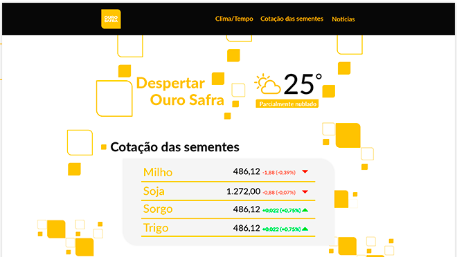

# Landing Page para empresa Projeto Despertar

Página para ser um portal onde o usuário tera acesso a cotação dos grão e temperatura da região onde se encontre e as principais noticias do ramo da agropecuária.

## ⚙️ Tecnologias Usadas

## Api usado no projeto

[AccuWeather APIs](https://developer.accuweather.com/)

### [Acesse o link e veja o projeto na integra](https://main--despertarourosafra.netlify.app/)
